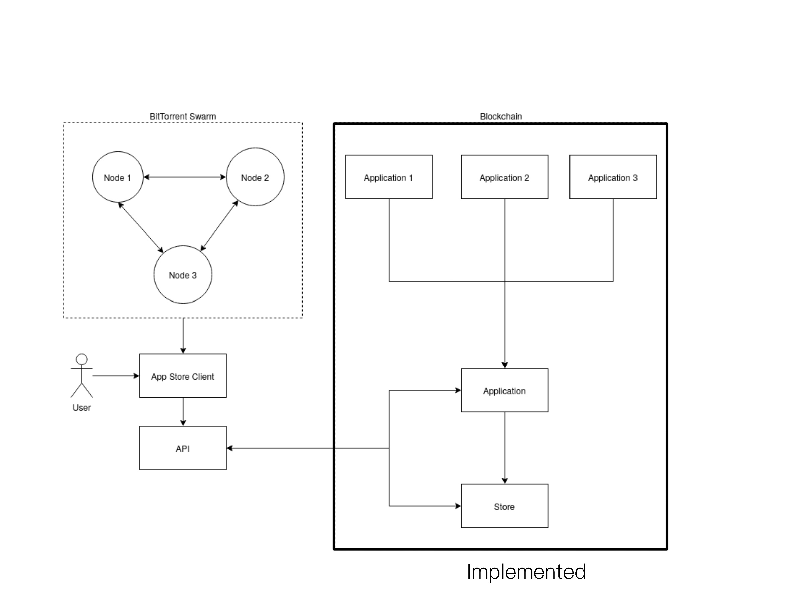

# Use Case Implementation Report

## Team 7 Members:

- **Aakash Jain**: 2019101028
- **Ishaan Shah**: 2019111028
- **Zeeshan Ahmed**: 2019111024

## Introduction

The objective of the use case is to build a decentralized application store, the Dapp Store, wherein we employ Smart Contracts to build an application that runs over the Ethereum protocol to handle transactions and the overall management of the platform. The BitTorrent protocol is used to facilitate transferring of files between users of the application. In addition to this, the Dapp Store also proposes a rigorous licensing check, the ability to transfer application ownership, and a voting mechanism for flagging and taking down malicious applications without accumulation of trust.

## Features of the Application

- Decentralized application marketplace
- Host and upload your applications
- Distributed application hosting (BitTorrent)
- Purchase applications with ethereum
- Encryption and licensing of hosted applications
- Ability to transfer application ownership for the same purchase
- Voting mechanism directly dependent on consensus algorithm for malicious applications

## System Design

The Dapp Store mostly revolves around its design in Smart Contracts. We employ two contracts for this process:

- Store Contract
- Application Contract

### Store Contract

The store contract serves as the point of contact for the frontend and provides communication to the applications. The store contract has a list of all the applications present in the Dapp Store and is able to call both general store methods, such as `fetchAllApplications()`, other than the public methods, it is also the only way to call private functions of application contract since it holds the contract itself. Since there might be a payment system for applications, we can't allow the users to access file pointers without ensuring payment. Note that this is only secure with frontend and encryptions.

### Application Contract

The application contract stores both general and confidential details of an application, and possesses application-specific methods, such as `transferOwnership()`, `getFilePointer()`, etc. It also maintains a mapping of which users have purchased the application, and each application instance in the Store contract possesses an Application contract.

## Limitations

As the primary focus of the use case is the Smart Contract and owing to its diverse and complex nature, the project implementation focuses on the robust and concrete implementation of the smart contract, as well as appropriate tests to gauge its functionalities. Due to time constraints, implementing the BitTorrent protocol, which involves creating a distributed swarm of nodes capable of hosting and transferring files, as well as a front-end wrapper around it, has not been feasible.

We considered implementing a rudimentary web application to demonstrate the contract's methods, but the elaborated test cases cover the same purpose, and thus the app store client and BitTorrent swarm have been considered a black box in the test cases.

### Parts covered

